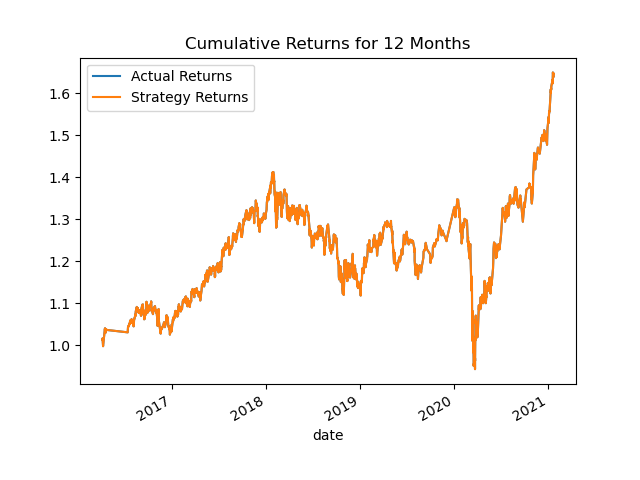

## What was done ?

Used the starter code file to complete the steps that the instructions outline. The steps for this Challenge are divided into the following sections:

* Establish a Baseline Performance

* Tune the Baseline Trading Algorithm

* Evaluate a New Machine Learning Classifier

* Create an Evaluation Report

### Established a Baseline Performance by doing the following

Used the provided starter code to establish a baseline performance for the trading algorithm. To do so, completed the following steps.

In the Jupyter notebook. Restarted the kernel, ran the provided cells that correspond with the first three steps, and then proceed to step four.

1. Imported the OHLCV dataset into a Pandas DataFrame.

2. Generated the trading signals using short- and long-window SMA values.

3. Split the data into training (X) and testing (y) datasets.

4. Use the `SVC` classifier model from SKLearn's support vector machine (SVM) learning method to fit the training data and make predictions based on the testing data. Review the predictions.

    To achieve this, the X and y datasets were scaled using StandardScaler() function

    

    Then, the data was subjected to prediction using SVC classifier model from sklearn.+svm

    

5. Generated and Reviewed the classification report associated with the `SVC` model predictions.

    The accuracy was pretty low at 56%

    

6. Created the predictions DataFrame that contains columns for “Predicted” values, “Actual Returns”, and “Strategy Returns”.

7. Created a cumulative return plot that shows the actual returns vs. the strategy returns. Save a PNG image of this plot. This will serve as a baseline against which to compare the effects of tuning the trading algorithm.

    Created the cumulative returns plot with 3 months of data with 4 days short-window and 100 days long-window as specified in the starter code

    

    ## Conclusion

    Classification Report showed pretty low accuracy rate which is 56%. The plot says - The Actual Returns were lower compared to the Strategy Returns going into 2021

### Tune the Baseline Trading Algorithm

    Tuned the training algorithm by adjusting the size of the training dataset. To achieve this, the data was sliced into 6 and 12 month periods. 

    Below are the results :

    The results for the 6 months window with 4 day short-window and 100 days long-window

    

    The results for 12 months window with 4 day short-window and 100 days long-window

    

    What impact resulted from increasing or decreasing the training window?

    Resizing the training window to 6 months fetched better results.

    Further Tuned the trading algorithm by adjusting the SMA input features. Adjust one or both of the windows for the algorithm. 

    Adjusted the Short and Long windows for 6 months training dataset..

    First reduced the Long Window to 60 days..

    Results for 4 day short-window and 60 day long window

    

    Increased the short window to 10 days and increased the long window to 200 days, below are the results.

    

    Answer the following question: What impact resulted from increasing or decreasing either or both of the SMA windows?

    Adjusting one of both of the windows did not fetch any better results compared to the default short and long windows provided in the starter code.

### Evaluated a New Machine Learning Classifier

    The original parameters from the starter code were used and ADA Boost classifier was used for prediction. 

    Imported the ADA Boost Classifier+

    

    Fit the original scaled training and predict using the original test data

    

3. Backtested the new model to evaluate its performance.

    Generated the Classification Report

    

    Generated the plot of the cumulative product of the actual returns vs. the strategy returns

    

    Answer the following questions: Did this new model perform better or worse than the provided baseline model? Did this new model perform better or worse than your tuned trading algorithm?

## Final Conclusion

ADA Boost cumulative returns graph shows slightly better results compared to the one generated using SVC with no major difference. However, looking at both the classification report, the accuracy percentage remains low around 55%.

